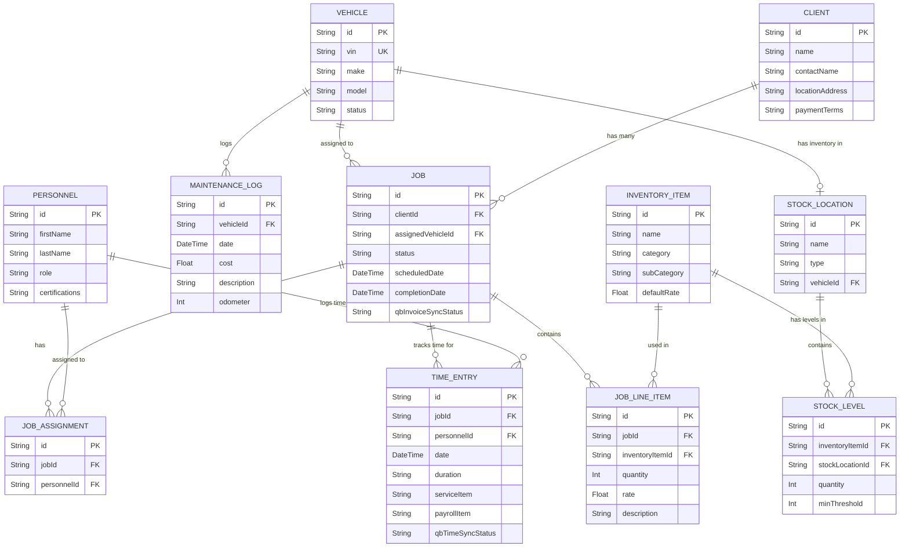

# White Van Field Operations Application - Architecture & Schema Plan

## 1. Core Objective & Architecture Acknowledgment
I have received and understood the parameters for the "White Van" application.
*   **Role:** Minimalist Field Operations management (no invoicing/payroll execution).
*   **Tech Stack:** Next.js (App Router) for full-stack React framework, Tailwind CSS, PostgreSQL via Prisma.
*   **Design:** Professional, high-contrast, minimalist (McKinsey/E&Y style) using the **Roboto** font.
*   **QuickBooks Export:** Strict CSV exports for Invoices (Line Items) and Time Tracking (Labor).
*   **Protocol:** "Explain Then Code" protocol will be strictly adhered to.

## 2. Entity-Relationship Diagram (ERD)

Below is the updated relational data architecture mapped out in Mermaid syntax. This schema supports multi-location inventory (warehouse vs. vans) and includes client-specific payment terms. I've also added QuickBooks sync status fields to prevent duplicate exports.

## 3. Explanation of Database Schema

### Clients & Jobs
*   **Client** stores the core CRM data. Crucially, it now includes `paymentTerms` (e.g., Net 15, Net 30), which will be used to dynamically calculate the Invoice Due Date during QuickBooks export.
*   **Job** acts as the central hub of operations. It tracks the core schedule, links directly to `Client` and `Vehicle`. I've added a `qbInvoiceSyncStatus` (e.g., "Pending", "Exported") to prevent accidental duplicate billing of line items.

### Personnel & Scheduling Engine
*   **Personnel** stores employee records.
*   **JobAssignment** allows multiple Technicians to be assigned to a single Job while ensuring only a single Vehicle is dispatched.

### Fleet & Maintenance
*   **Vehicle** tracks the fleet.
*   **MaintenanceLog** records individual maintenance events linked to a Vehicle.

### Inventory Control (Warehouse & Van)
*   **InventoryItem** defines the global product catalog. It holds the QuickBooks required `category`, `subCategory`, and `name`.
*   **StockLocation** defines a physical place where inventory is held. It can be a "Warehouse" or linked directly to a "Vehicle" via the `vehicleId` foreign key.
*   **StockLevel** maps a specific `InventoryItem` to a `StockLocation`, tracking real-time `quantity` and `minThreshold` per van or warehouse.
*   **JobLineItem** links consumed items directly to the Job. When a Job is completed, the system will deduct the consumed quantity from the `StockLevel` associated with that Job's `assignedVehicleId`.

### QuickBooks Time Tracking
*   **TimeEntry** matches the Quickbooks Labor Export schema. It enforces the `duration` text format (HH:MM). Like Jobs, it includes `qbTimeSyncStatus` to prevent exporting duplicate timesheets.

## User Review Required

> [!IMPORTANT]
> **Feedback Needed Before Proceeding:**
> Please review this updated schema. If this aligns perfectly with your operations, I will move into execution and begin Phase 1 (Next.js initialization and Prisma model setup) using the strict "Explain Then Code" protocol.
